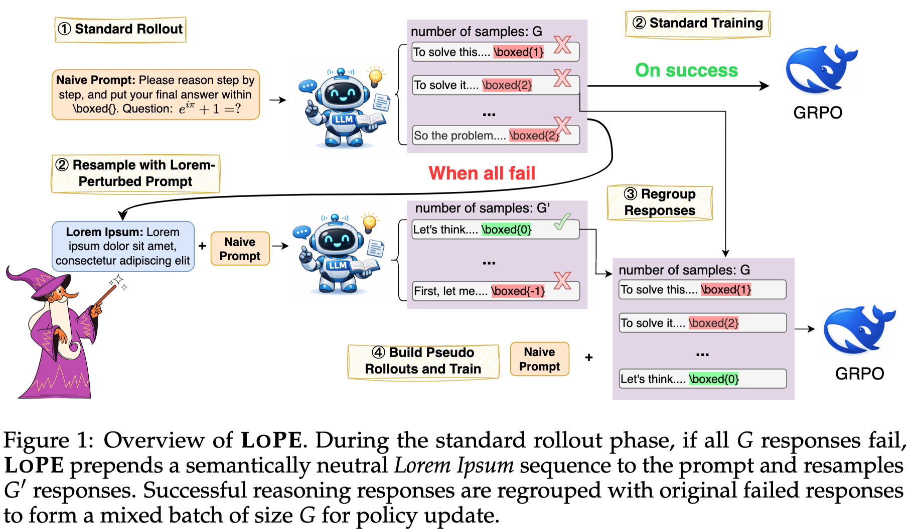
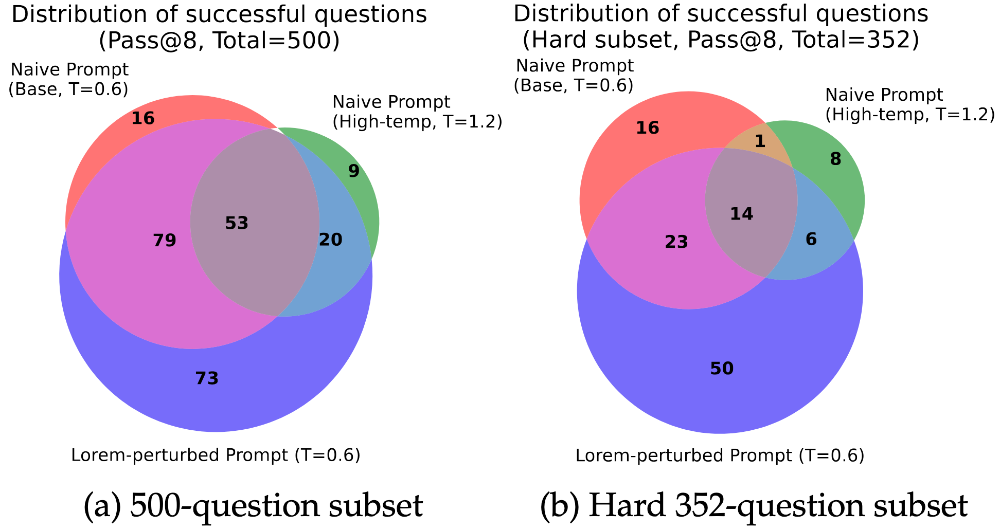

# LoPE: Lorem Perturbation for Exploration

> **Nonsense Helps: Prompt Space Perturbation Broadens Reasoning Exploration**
>
> [Langlin Huang](https://shrango.github.io/), [Chengsong Huang](https://chengsong-huang.github.io/), [Jinyuan Li](https://sites.google.com/view/jinyuanli), [Donghong Cai](https://ilikevegetable.github.io/), [Yuyi Yang](https://yyuyi.github.io/), [Jiaxin Huang](https://teapot123.github.io/)
>
> [HINT Lab](https://teapot123.github.io/application/), Washington University in St. Louis
>
> 📄 [Paper (arXiv)]() · 💻 [Code](https://github.com/shrango/LoPE)

---

## 🚀 Overview

**LoPE** is a simple yet effective resampling strategy for GRPO-style reinforcement learning that breaks through the **zero-advantage problem** — the situation where all sampled rollouts for a hard question fail, the relative advantage collapses to zero, and the training signal is wasted.

Instead of just throwing more compute at logit-space exploration (e.g., higher temperature), **LoPE prepends a randomly generated *Lorem Ipsum* sequence to the prompt** before resampling. This semantically neutral, prompt-space perturbation shifts the model's output distribution just enough to unlock orthogonal reasoning trajectories — without distorting its understanding of the question.

<p align="center">
  
</p>

> **Figure 1.** During the standard rollout phase, if all *G* responses fail, LoPE prepends a Lorem Ipsum sequence to the prompt and resamples *G′* responses. Successful responses are regrouped with the original failed ones to form a mixed batch of size *G* for policy update.

---

## ✨ Key Findings

- **🎯 Zero-Advantage Recovery.** When all initial rollouts fail, LoPE-perturbed resampling recovers correct trajectories that neither naive resampling nor high-temperature sampling can hardly succeed.
- **🧭 Orthogonal Exploration.** On a hard 352-question subset, Lorem-perturbed prompts independently solve more questions that other methods miss (see Figure 2).
- **🧬 Controlled Perplexity is Key.** Among all tested prompt space perturbations, the top-performance three use perturbation with lower perplexity (closest to natural language). Their perturbation intensity is sufficient to drive exploration, avoiding detrimental effects of excessive noise.
- **📈 Consistent Gains.** Average improvement of **+2.79** on Qwen3-1.7B-Base, **+4.62** on Qwen3-4B-Base, and **+6.20** on Qwen2.5-Math-7B across five math benchmarks.

<p align="center">
  
</p>

> **Figure 2.** Venn diagrams of questions successfully resolved (Pass@8) by naive prompting, high-temperature sampling, and Lorem perturbation. LoPE unlocks reasoning paths that pure logit-space methods cannot reach.

---

## 🧠 Why Lorem Ipsum?
 
We need a perturbation that is **structurally similar to natural language** but **semantically empty** — so it doesn't leak hints or distort the question. Lorem Ipsum fits perfectly, and our analysis reveals a clear pattern across 9 perturbation types:
 
| Perturbation Type | Mean Perplexity | Regime |
|---|---|---|
| Question Text (reference) | 4.82 | Natural language (English) |
| **Lorem Ipsum** ✅ | **25.12** | Near-natural |
| Latin Natural Language | 46.09 | Near-natural |
| Latin Unigram Model | 51.32 | Near-natural |
| English Unigram Model | 85.30 | Near-natural |
| Latin 3-Gram Model | 91.45 | Near-natural |
| Random ASCII | 492.93 | Moderately OOD |
| Random Fake English | 2,429.9 | Moderately OOD |
| Random Tokens ❌ | 4.6 × 10⁵ | Severely OOD |
 
The key insight: **moderate, near-natural perturbation increases response entropy and promotes exploration without harming the input representation.** Excessively high-perplexity perturbations (e.g., Random Tokens) corrupt the model's understanding of the question itself, as confirmed by both token-level entropy analysis and t-SNE visualization of question representations.
 
Beyond the mean, Lorem Ipsum also exhibits the **lowest standard deviation (2.84)** among all synthetic perturbations, ensuring a consistent, controlled distributional shift across samples — a property that other low-mean methods (e.g., Natural Language Latin with std 42.63) lack.
 
---
 
## 📊 Main Results
 
Results on five math reasoning benchmarks (MATH-500, GSM8K, AMC, AIME24, AIME25):
 
| Model & Method | MATH-500 | GSM8K | AMC | AIME24 | AIME25 | **Avg.** |
|---|:-:|:-:|:-:|:-:|:-:|:-:|
| **Qwen3-1.7B-Base** | 63.40 | 76.92 | 26.87 | 5.33 | 2.00 | 34.90 |
| &nbsp;&nbsp;+ GRPO | 64.20 | 82.71 | 27.61 | 6.15 | 4.47 | 37.03 |
| &nbsp;&nbsp;+ Resample w/ Naive Prompt | 67.00 | 82.18 | 28.36 | 8.70 | 4.58 | 38.16 |
| &nbsp;&nbsp;+ Resample w/ **LoPE** | 68.80 | 82.94 | 32.84 | 8.80 | 5.73 | **39.82** |
| **Qwen3-4B-Base** | 65.80 | 82.71 | 32.84 | 9.38 | 7.24 | 39.59 |
| &nbsp;&nbsp;+ GRPO | 77.80 | 91.74 | 47.76 | 16.41 | 13.12 | 49.37 |
| &nbsp;&nbsp;+ Resample w/ Naive Prompt | 79.80 | 92.87 | 45.52 | 14.90 | 11.67 | 48.95 |
| &nbsp;&nbsp;+ Resample w/ **LoPE** | 82.60 | 92.95 | 58.21 | 19.90 | 16.27 | **53.99** |
| **Qwen2.5-Math-7B** | 52.80 | 65.50 | 35.40 | 12.90 | 7.90 | 34.90 |
| &nbsp;&nbsp;+ GRPO | 78.00 | 85.06 | 47.76 | 17.66 | 9.90 | 47.68 |
| &nbsp;&nbsp;+ Resample w/ Naive Prompt | 78.20 | 83.02 | 50.00 | 17.19 | 9.17 | 47.52 |
| &nbsp;&nbsp;+ Resample w/ **LoPE** | 81.80 | 90.30 | 61.19 | 19.58 | 16.51 | **53.88** |
 
### Comparison of Prompt Perturbation Strategies (Qwen3-1.7B-Base)
 
All perturbation methods below use Training Signal Shaping. The three top performers (**LoPE**, **Latin Natural Language**, **Latin Unigram Model**) share the lowest perplexity values among all evaluated perturbations.
 
| Method | MATH-500 | GSM8K | AMC | AIME24 | AIME25 | **Avg.** |
|---|:-:|:-:|:-:|:-:|:-:|:-:|
| GRPO | 64.20 | 82.71 | 27.61 | 6.15 | 4.47 | 37.03 |
| *Resample w/o perturbation* | | | | | | |
| w/ Naive Prompt | 67.00 | 82.18 | 28.36 | 8.70 | 4.58 | 38.16 |
| w/ Naive Prompt (Temp=1.2) | 64.40 | 82.87 | 31.34 | 8.65 | 4.48 | 38.35 |
| *Resample w/ perturbation* | | | | | | |
| **w/ LoPE** | 68.80 | 82.94 | 32.84 | 8.80 | 5.73 | **39.82** |
| w/ Latin Natural Language | 68.80 | 82.71 | 32.84 | 9.32 | 5.57 | **39.85** |
| w/ Latin Unigram Model | 69.40 | 83.32 | 32.09 | 7.19 | 6.35 | **39.67** |
| w/ Latin 3-Gram Model | 68.80 | 81.88 | 29.85 | 7.92 | 5.93 | 38.88 |
| w/ English Unigram Model | 67.00 | 83.32 | 28.36 | 8.49 | 5.42 | 38.52 |
| w/ Random Fake English | 65.80 | 81.96 | 32.09 | 7.50 | 5.42 | 38.55 |
| w/ Random ASCII | 66.20 | 82.94 | 28.36 | 8.12 | 5.32 | 38.19 |
| w/ Random Token | 64.20 | 81.50 | 29.85 | 8.08 | 4.63 | 37.65 |
 
> **Takeaway:** The most effective prompt-space perturbations share two characteristics: (i) composed of **Latin** words, and (ii) **relatively low perplexity**. English-based perturbations (e.g., English Unigram Model) tend to interfere with the model's original English reasoning context, while extremely high-perplexity perturbations (e.g., Random Token) corrupt the model's input understanding.
 
---

## 🛠️ Method at a Glance

LoPE follows the standard GRPO training loop with three modifications when all initial rollouts fail:

1. **Rollout with Perturbation.** Prepend a random Lorem Ipsum sequence *δ* (100–300 tokens) to the original prompt *p*, then sample *G′* additional responses from $\pi_{\theta_{old}}(o' | \delta \oplus p, q)$.
2. **Regroup Responses.** Replace failed rollouts with successful resampled ones, keeping the group size at *G* and at least one incorrect response so advantages remain non-zero.
3. **Advantage Estimation with Importance Correction.** Convert resampled responses into pseudo rollouts paired with the naive prompt, and correct the distribution shift via:

$$\rho_{i,t} = \frac{\pi_\theta(o'_{i,t} \mid p, q, o'_{i,<t})}{\pi_{\theta_\text{old}}(o'_{i,t} \mid \delta \oplus p, q, o'_{i,<t})}$$

4. **Training Signal Shaping.** Reshape the importance ratio to `ρ' = ρ / (ρ + 0.1)` to amplify low-probability tokens corresponding to critical reasoning steps, and compute group advantage over all *G + G′* rollouts to restore training weights of rare successes to a larger value. Refer to Appendix C for details.
5. **No KL Regularization.** KL constraints counteract the broader exploration LoPE aims to promote.

---

## ⚙️ Setup

```bash
# Clone the repository
git clone https://github.com/shrango/LoPE.git
cd LoPE

# Install dependencies
pip install -r requirements.txt
```

Our implementation is built on top of [EasyR1](https://github.com/hiyouga/EasyR1).

---

## 🏃 Quick Start

### Training

```bash
python3 -m verl.trainer.main \
    config=examples/config.yaml \
    data.max_response_length=8192 \
    data.max_prompt_length=2048 \
    worker.rollout.max_num_batched_tokens=10240 \
    data.train_files=$OPENR1DATA \
    data.format_prompt=examples/format_prompt/math.jinja \
    data.val_files=$MATHTEST \
    worker.actor.model.model_path=Qwen/Qwen3-1.7B-Base \
    trainer.save_checkpoint_path=$SAVE_DIR \
    worker.rollout.n=8 \
    algorithm.use_kl_loss=false \
    algorithm.disable_kl=true \
    algorithm.kl_coef=0.0 \
    data.use_lorem=true \
    data.lorem_word_min=100 \
    data.lorem_word_max=300 \
    data.rollout_batch_size=128 \
    data.val_batch_size=1024 \
    worker.actor.global_batch_size=128 \
    trainer.val_before_train=true \
    trainer.n_gpus_per_node=4 \
    worker.rollout.gpu_memory_utilization=0.8
```

### Evaluation

We use [EvalScope](https://github.com/modelscope/evalscope) with sampling temperature 0.6 and top-p 0.95. We report Acc@1 for MATH-500, GSM8K, and AMC, and Mean@32 for AIME24 and AIME25.

---

## 🔍 Hyperparameters

| Parameter | Value |
|---|---|
| Group size *G* | 8 |
| Resample size *G′* | 24 |
| Rollout temperature | 1.0 |
| Eval temperature | 0.6 |
| Eval top-p | 0.95 |
| Lorem sequence length | 100–300 tokens |
| Max response length | 8,192 tokens |
| Max input length | 2,048 tokens |
| KL coefficient | 0 (removed) |

A short boundary instruction `\nPlease reason step by step, and put your final answer within \boxed{}.` is appended after the Lorem Ipsum sequence to prevent the model from generating corrupted outputs.

---

## 📌 Citation

If you find LoPE useful in your research, please cite:

```bibtex
@article{huang2026lope,
  title   = {Nonsense Helps: Prompt Space Perturbation Broadens Reasoning Exploration},
  author  = {Huang, Langlin and Huang, Chengsong and Li, Jinyuan and Cai, Donghong and Yang, Yuyi and Huang, Jiaxin},
  journal = {arXiv preprint},
  year    = {2026}
}
```

---

## 🙏 Acknowledgements
This research was supported in part by the NVIDIA Academic Grant Program and WashU Ignite Interdisciplinary Grants.

Our code is built upon [EasyR1](https://github.com/hiyouga/EasyR1). We thank the authors of [Qwen](https://github.com/QwenLM/Qwen3), [OpenR1-Math](https://huggingface.co/datasets/open-r1), and [python-lorem](https://github.com/JarryShaw/lorem) for their open-source contributions.
